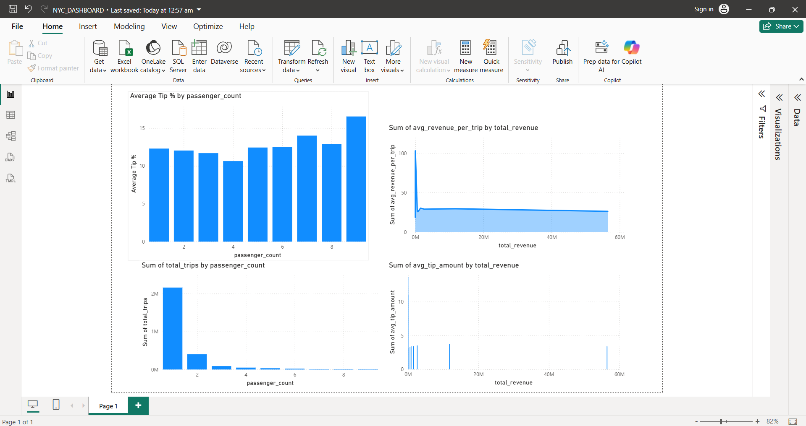
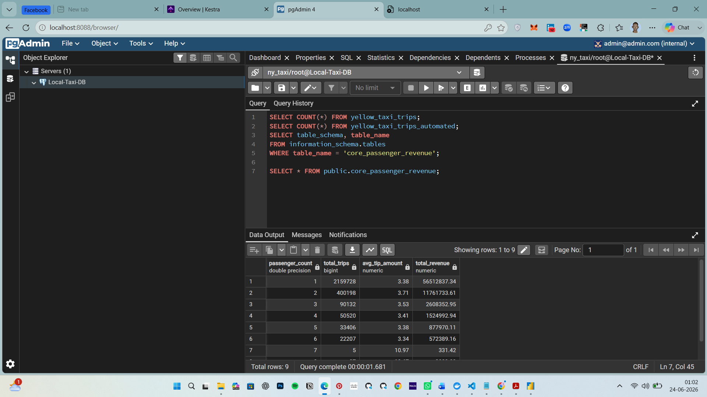
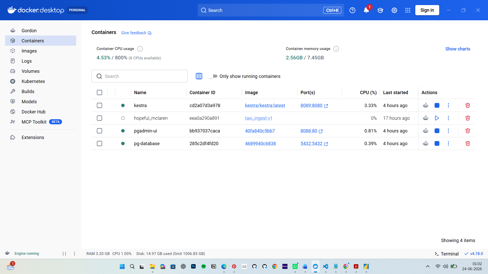
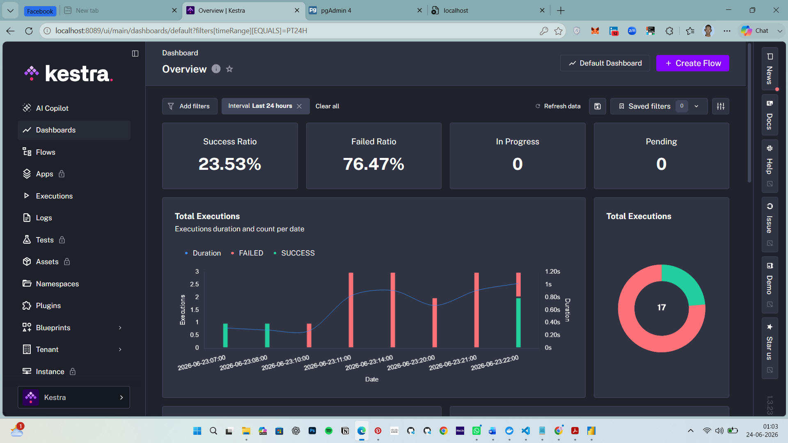
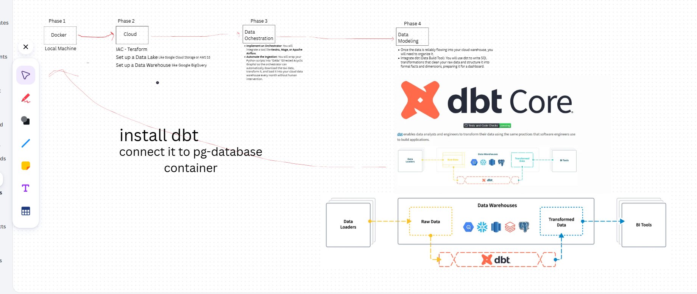

End-to-End Local Modern Data Stack: NYC Taxi Data Pipeline
Author: Abraham Makur Dhuor

Project Overview
This project demonstrates a fully functional, containerized Modern Data Stack running entirely in a local environment. It automates the extraction of raw NYC Yellow Taxi trip data, loads it into a PostgreSQL data warehouse, performs SQL-based transformations to generate business-ready metrics, and connects to a Business Intelligence tool for interactive dashboarding.

The entire pipeline is orchestrated using Kestra, ensuring isolated execution and dependency management via Docker networks.

Architecture & Tech Stack
Orchestration: Kestra (Docker-based execution)

Data Ingestion: Python (Pandas, SQLAlchemy, PyArrow)

Data Warehouse: PostgreSQL

Data Transformation: dbt (Data Build Tool)

Business Intelligence: Power BI

Repository File Structure
The project relies on a specific file directory structure mounted within Kestra to ensure dbt and Python execute correctly:

Plaintext
local.data.warehouse (Kestra Namespace)
│
├── ny_taxi_models/                # dbt Project Root
│   ├── models/
│   │   ├── stg_taxi_trips.sql         # Base view of raw data
│   │   ├── core_passenger_revenue.sql # Aggregated revenue metrics
│   │   └── mrt_trip_performance.sql   # Advanced tipping & trip volume metrics
│   ├── dbt_project.yml            # dbt configuration and materialization rules
│   └── .gitignore
│
├── profiles.yml                   # dbt connection credentials for Postgres
└── ingest_data.py                 # Python script for database loading
Pipeline Stages
1. Extract & Load (Python Ingestion)
The pipeline begins by spinning up a python:3.9 container. It utilizes a shell command to download a raw .parquet file directly from the TLC Trip Record Data cloudfront distribution.
Once downloaded, the ingest_data.py script utilizes pandas and sqlalchemy to efficiently chunk and load the Parquet data into a yellow_taxi_trips_automated table inside the PostgreSQL warehouse.

2. Transform (dbt)
Following successful ingestion, a dbt-postgres container is triggered. It connects to the database using profiles.yml and executes the models located in the ny_taxi_models directory:

Data Type Casting: Strict enforcement of NUMERIC types to prevent floating-point calculation errors during aggregation.

Aggregations: Calculates total trips, average tip amounts, total revenue, and average tip percentages grouped by passenger count.

Materialization: Outputs clean, analytics-ready tables (core_passenger_revenue, mrt_trip_performance) directly into the public schema.

3. Orchestration (Kestra Flow)
The execution logic is defined in a declarative YAML flow. It utilizes Kestra's io.kestra.plugin.scripts.shell.Commands to run consecutive Docker containers on the same pg-network as the database, ensuring seamless inter-container communication.

Visualization Setup
The output tables are designed for seamless integration with downstream BI tools.

Connection Parameters:

Host: localhost

Port: 5432

Database: ny_taxi

Credentials: Managed via local Docker environment variables.

Key Dashboard Insights:
The Power BI dashboard visualizes the finalized dbt models, highlighting trends such as:

Average Tip % by Passenger Count: Identifies which group sizes are the most generous (utilizing the "Don't summarize" rule in Power BI to preserve dbt's pre-aggregated math).

Trip Volume Curves: Maps total_trips against passenger_count to identify peak vehicle utilization.

